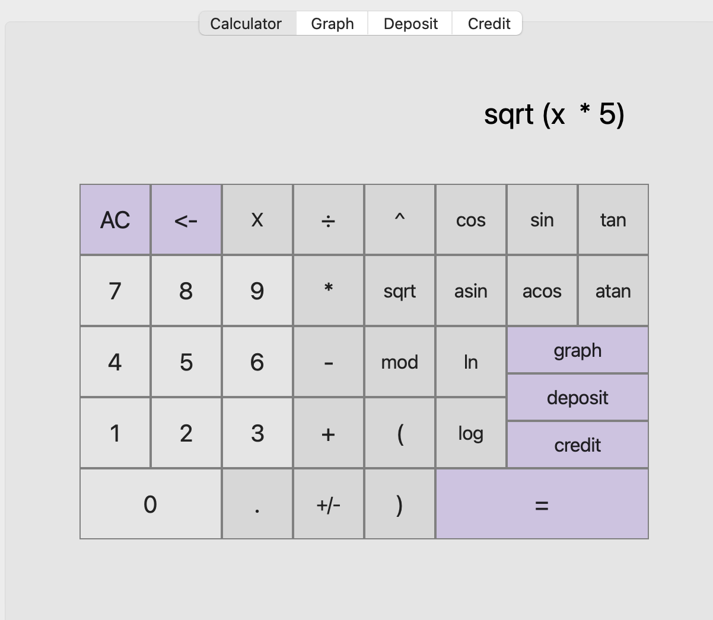
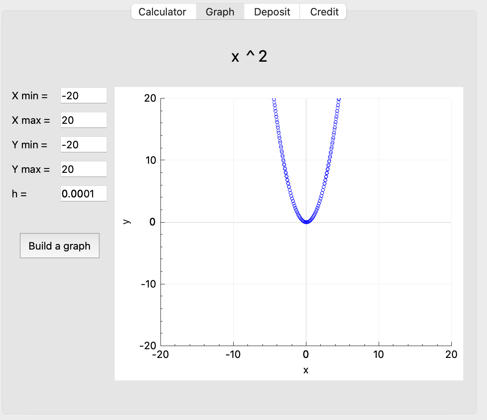
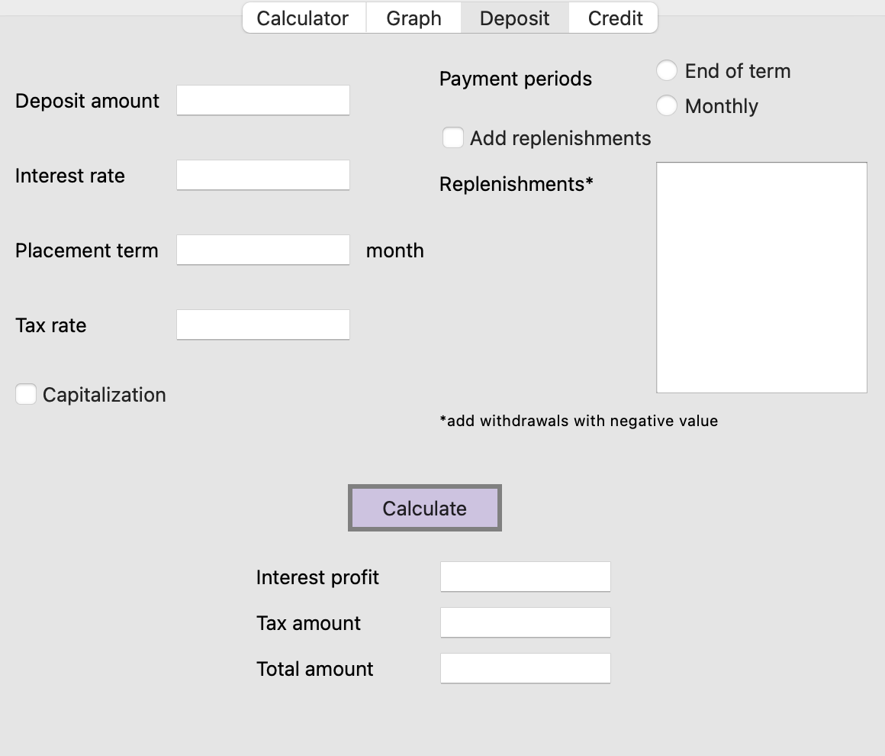
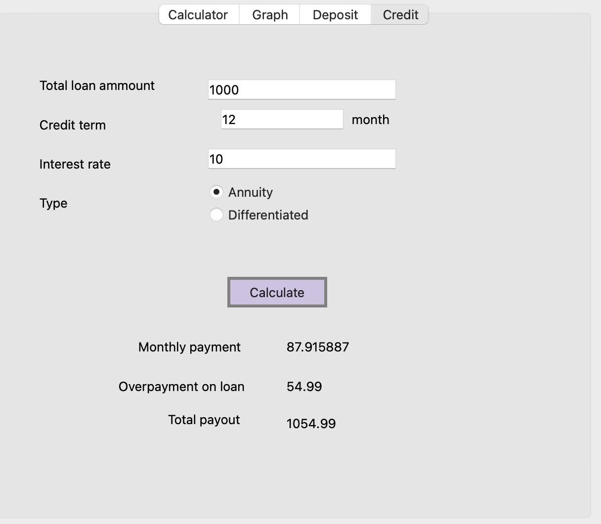

# SmartCalc

Implementation of extended calculator in the C/C++ and QT. In addition to basic arithmetic operations it calculates arithmetic expressions by following the order, as well as some mathematical functions (sine, cosine, logarithm, etc.). 

It also supports the use of the x variable and the graphing of the corresponding function. Also it has a credit and deposit calculator.

